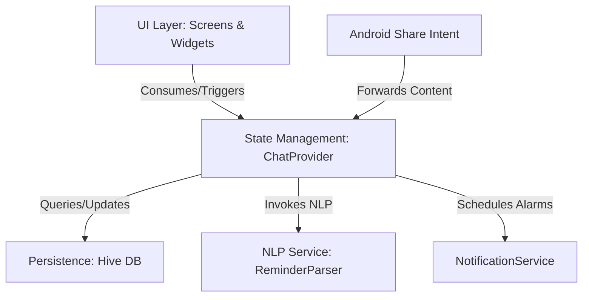

# 💜 Memzy — Chat-Based Personal Memory Assistant

Memzy is a premium, high-fidelity mobile personal memory assistant built with Flutter. Inspired by the **Stitch UI** design language, it allows you to store notes, files, and reminders in a familiar, intuitive chat interface.

---

## ⚠️ Problem Statement
People often scatter important information across multiple places—such as WhatsApp, Notes apps, PDFs, screenshots, and browser bookmarks. As a result, important tasks, ideas, and documents are easily forgotten or lost.

## 💡 The Solution
**Memzy** solves this by providing a single, consolidated platform where users can save all kinds of content in a familiar chat format. It automatically parses text messages to extract reminders, schedules notifications, and organizes attachments (images, PDFs, documents, links) into a unified workspace.

---

## 🏗️ Architecture



*   **UI Layer (`lib/screens`, `lib/widgets`)**: Implements components following the Stitch UI visual system.
*   **State Management (`lib/providers`)**: `ChatProvider` orchestrates application flow, database synchronization, and event triggers.
*   **NLP Parser (`lib/services/reminder_parser.dart`)**: Identifies time clauses in user messages to extract structured reminders.
*   **Alarms & Notifications (`lib/services/notification_service.dart`)**: Interfaces with native OS layers to schedule exact local notifications.
*   **Local Storage (`lib/models`, `lib/services/database_service.dart`)**: Offline-first persistence built on high-performance Hive boxes.

---

## 🎨 Premium Stitch UI & Design System

*   **Amethyst Palette**: High-contrast light and dark themes using Indigo (`#45346A`) and Rose (`#EC4899`) accents.
*   **Asymmetric Custom Tails**: Conversation bubbles with directional rounded corners (user tails on the right, system on the left).
*   **Glassmorphic Navigation**: Frosted-glass bottom navigation overlaying app content.
*   **Bento Media Grid**: Media, links, and documents presented in a high-fidelity bento-grid layout.

---

## ⚡ Core Features

*   **Chat-Based Storage**: Group and save text messages, web links, images, PDFs, and documents.
*   **Auto-Reminder Extraction**: Instantly parses message text for time clauses to schedule local alarms.
*   **Auto-Reply Confirmation**: Responds automatically (e.g., `✓ Noted`) when a reminder is created.
*   **"Forward to Memzy" Share Target**: Integrates with system-level sharing to save links, text, and files from external apps directly into chats.
*   **Interactive Image Viewer**: Immersive full-screen view supporting pinch-to-zoom (up to `4.0x`) and panning.
*   **Multi-Selection & Batch Actions**: Long-press bubbles/attachments to multi-select and delete or star/unstar.

---

## 🛠️ Tech Stack & Dependencies

*   **Framework**: Flutter & Dart
*   **State Management**: `provider`
*   **Database**: `hive` & `hive_flutter` (local persistence)
*   **Alarms & Notifications**: `flutter_local_notifications`
*   **Incoming Intents**: `receive_sharing_intent`
*   **Typography**: `google_fonts` (Geist, Outfit, Inter)
*   **File Selection**: `image_picker` & `file_picker`

---

## 🚀 Getting Started

### Prerequisites
*   Flutter SDK configured on your system
*   An active Android/iOS emulator or connected device

### Steps
1.  **Retrieve Dependencies**:
    ```bash
    flutter pub get
    ```
2.  **Generate Database Adapters**:
    ```bash
    flutter pub run build_runner build --delete-conflicting-outputs
    ```
3.  **Run the App**:
    ```bash
    flutter run
    ```
4.  **Run Automated Tests**:
    ```bash
    flutter test
    ```
